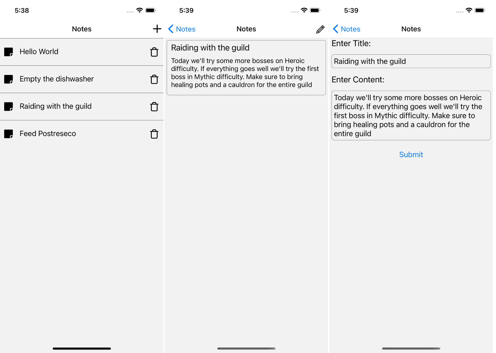

# RN Notes - a simple note-keeping app.

Simple note-keeping app using React createContext() & useContext() to manage app state.
It uses ngrok to host a JSON file which stores the notes.

API: https://ngrok.com/

